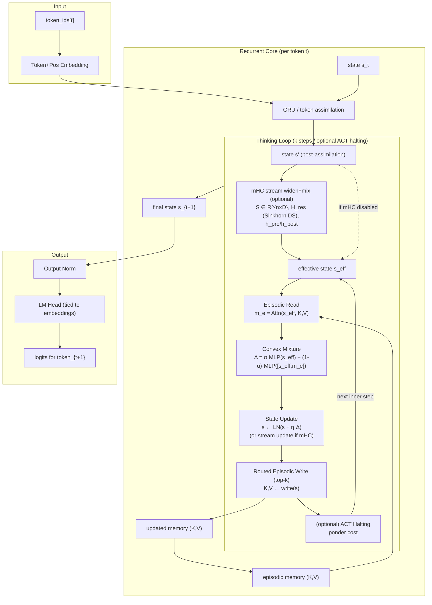
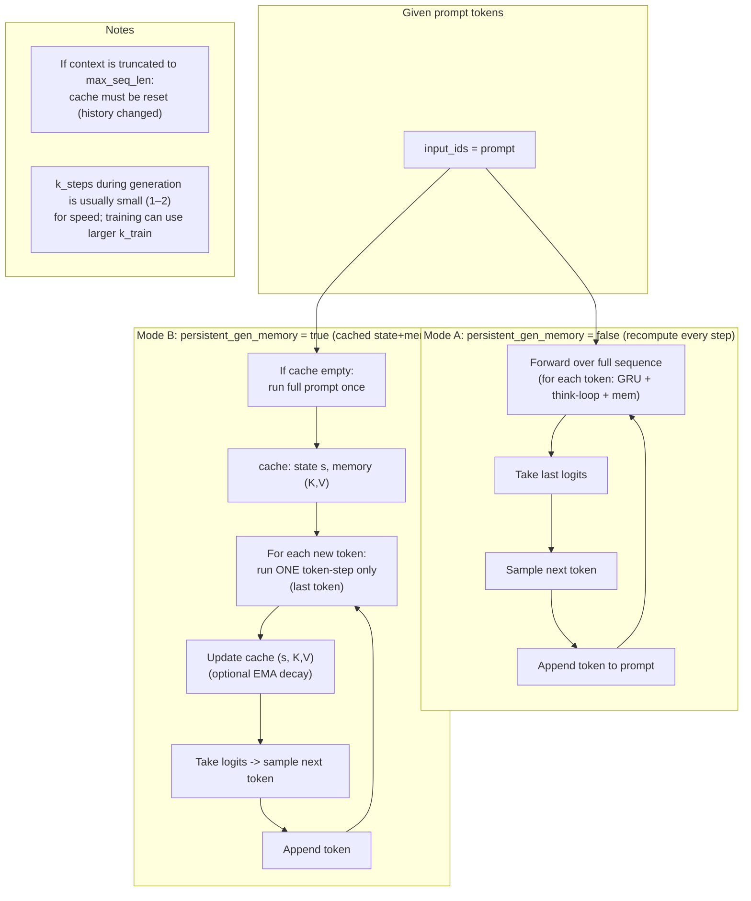
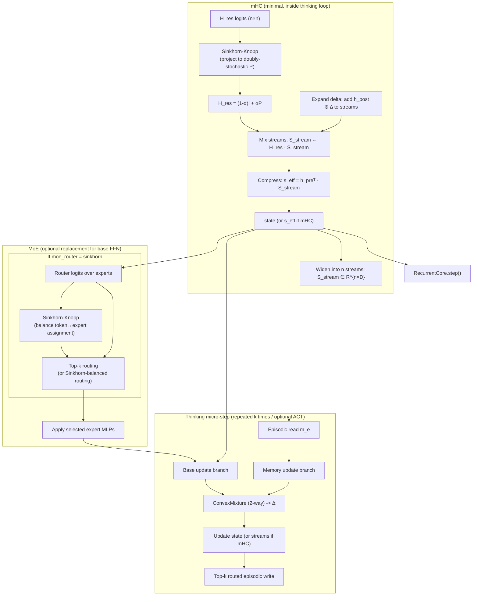

## R3M (Recurrent + Reasoning + Memory) — Architecture Overview (with diagrams)

This document explains the **implemented** R3M recurrent language model architecture in this repo and includes the diagrams we discussed.

### Where the implementation lives

- **Model**: `src/models/r3m_recurrent.py`
  - `R3MRecurrentConfig`
  - `R3MRecurrentLM`
  - `R3MRecurrentCore`
  - `EpisodicMemory` (KV memory + routed writes)
  - **mHC (minimal)** stream mixing utilities (e.g. `sinkhorn_birkhoff`, core mHC params)
  - **MoE (optional)** feedforward (`MoEFeedForward`)
- **HF streaming pretrain**: `scripts/pretrain_r3m_recurrent_hf.py`
- **Sampling from checkpoints**: `scripts/generate_r3m_recurrent_samples.py`

---

## Diagram 1 — High-level model flow (per token)

### What this means

- The model is **causal by construction**: it processes tokens **one-by-one** and produces logits for the next token from the updated state.
- Each token step has:
  - **Assimilation** (GRU)
  - **Thinking** (k micro-steps, optionally adaptive halting)
  - **Memory read/write** (episodic KV slots)

---

## Diagram 2 — Generation dataflow (persistent memory on/off)

### What this means

- **Without** persistent generation memory: generation cost grows with prompt length (recompute).
- **With** persistent generation memory: after the first prompt pass, each new token is ~constant work (one token-step).

---

## Diagram 3 — mHC + MoE placement (where Sinkhorn is used)

### What this means

- **mHC (minimal)**: uses Sinkhorn to constrain the **stream mixing matrix** inside the thinking loop.
- **MoE (optional)**: uses either top‑k routing or Sinkhorn-balanced routing for **expert selection**.

---

## Key properties (in plain language)

- **Causal + streaming-friendly**: token-by-token state update enables incremental generation and avoids future leakage.
- **Variable compute per token**: `k_train` / optional adaptive halting means “think more on harder tokens”.
- **Episodic memory**: external KV slots for retrieval and selectively routed writes (top‑k).
- **Stability knobs**:
  - write-rate regularization prevents “always write” collapse
  - mHC-style constrained mixing preserves identity-like behavior in deeper inner loops

---

## Notes for training/evaluation

- When evaluating early pretraining, use prompts that match the data distribution (e.g. book-style prompts for Gutenberg).
- Instruction-style behavior is best introduced via a small instruction stage or distillation.

